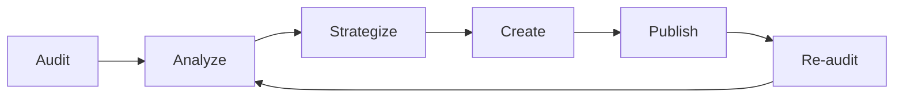

## Overview

This workflow covers the end-to-end process of improving your brand's AI citations. It starts with understanding your current visibility, moves through gap analysis and content creation, and ends with verification through re-auditing.

Follow this workflow when you are starting with CiteScore for the first time or when you want to run a focused campaign to improve your AI visibility.

## The Workflow

### Step 1: Establish Your Baseline

Run your first [AEO Audit](/product/aeo-audits) to understand where you stand.

- Select the AI model most relevant to your audience (start with ChatGPT if unsure)
- Review your overall AEO Score
- Note your mention rate and average rank

<Tip>
  Run audits across multiple AI models for a complete picture. Your visibility may differ significantly between ChatGPT, Gemini, Claude, and Perplexity.
</Tip>

### Step 2: Identify Gaps

Review the per-question breakdown from your audit:

1. **Sort by score** — find questions where you scored 0 (not mentioned)
2. **Check competitor mentions** — note which competitors appeared where you did not
3. **Categorize the gaps** — group missing questions by theme (e.g., "comparison queries", "use-case queries", "audience-specific queries")
4. **Prioritize** — focus on gaps where competitors are mentioned (these represent active visibility losses)

### Step 3: Run a Website GEO Audit

Run a [Website GEO Audit](/product/website-geo-audit) to identify structural issues with your existing content:

- Which pages score low on Answer Formatability?
- Which pages lack clear Entity Clarity?
- Are there pages that should exist but don't?

Address high-priority website recommendations before creating new content.

### Step 4: Generate a Strategy

Use the [Strategy feature](/product/strategy) to create a content roadmap:

- Review keyword themes for alignment with your audit gaps
- Identify question clusters that map to your weakest areas
- Prioritize content types that address your specific gaps

### Step 5: Create Targeted Content

Use [Content Generation](/product/content-generation) to produce content addressing your gaps:

- **For category gaps** — create landing pages that position your brand clearly in your category
- **For comparison gaps** — create comparison content that helps AI understand your differentiators
- **For use-case gaps** — create use-case guides for specific audiences or scenarios
- **For question-answer gaps** — create FAQ content with direct answers to the questions where you are missing

Ensure each piece follows AEO principles:
- Lead with direct answers
- Use question-format headings
- Include structured FAQ sections
- Link to related content on your site

### Step 6: Publish and Distribute

Deploy your content to your website:

- Publish on your domain (not just third-party platforms)
- Ensure proper indexing (no noindex tags, included in sitemap)
- Add internal links from existing pages to new content
- Share on channels where it can earn external mentions (social, email, partnerships)

### Step 7: Wait and Re-Audit

AI systems take time to incorporate new content:

- **Retrieval-based models** (Perplexity, Gemini) may reflect changes within days to weeks
- **Training-based models** (ChatGPT, Claude) may take weeks to months, depending on training cycles

Run a follow-up audit after 4–8 weeks to measure impact. Compare:
- Overall AEO Score change
- Per-question improvements for the specific gaps you targeted
- Competitor mention changes

### Step 8: Iterate

Based on re-audit results:
- Double down on content strategies that improved visibility
- Revise approaches that did not move the needle
- Identify new gaps that may have emerged
- Return to Step 2 and repeat the cycle

## Timeline

| Phase | Duration | Activities |
|-------|----------|-----------|
| Baseline | Day 1 | Run initial AEO and GEO audits |
| Analysis | Days 2–3 | Review results, identify gaps, generate strategy |
| Creation | Weeks 1–2 | Generate and publish targeted content |
| Incubation | Weeks 3–6 | Wait for AI systems to process new content |
| Verification | Week 6–8 | Re-audit and compare results |

## FAQ

<AccordionGroup>
  <Accordion title="How long does it take to improve AI visibility?">
    Improving AI visibility is a cumulative effort. Retrieval-based models like Perplexity may reflect changes within weeks. Training-based models like ChatGPT may take longer. Plan for 4–8 weeks between content publication and measurable impact.
  </Accordion>
  <Accordion title="What if my score doesn't improve after creating content?">
    Check that content is properly indexed and accessible. Verify that you are targeting the right questions. Consider expanding to more authoritative distribution channels. AI visibility improvement is often gradual rather than sudden.
  </Accordion>
  <Accordion title="Should I focus on one AI model or all of them?">
    Start with the model most relevant to your audience, then expand. Different models have different data sources, so content that improves visibility on one model may not immediately affect another.
  </Accordion>
</AccordionGroup>

## Next Steps

<CardGroup cols={2}>
  <Card title="Monthly Audit Workflow" icon="calendar" href="/workflows/monthly-audit">
    Set up ongoing monitoring after your initial campaign.
  </Card>
  <Card title="AEO Audits" icon="magnifying-glass-chart" href="/product/aeo-audits">
    Run your first audit to begin the workflow.
  </Card>
</CardGroup>
